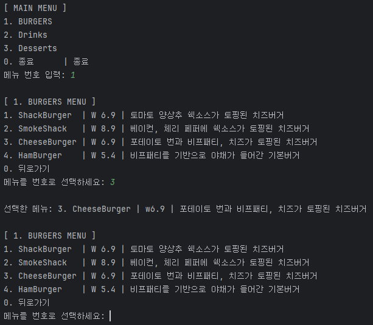
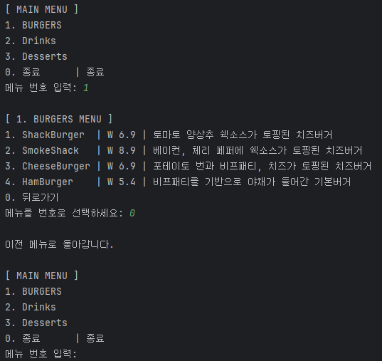
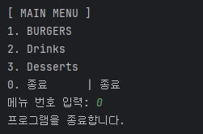
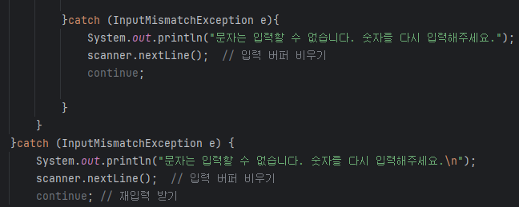
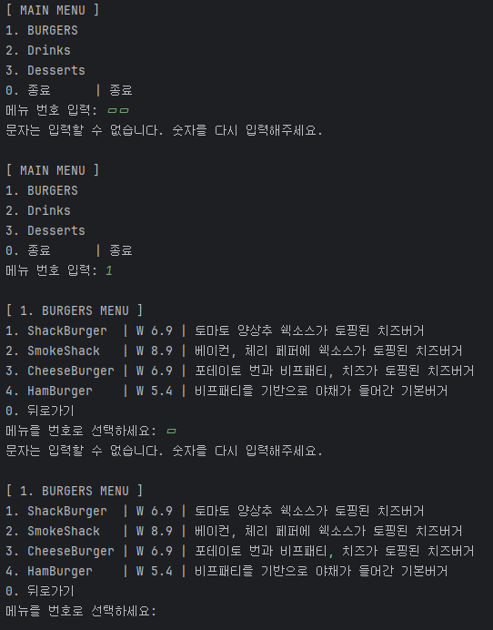
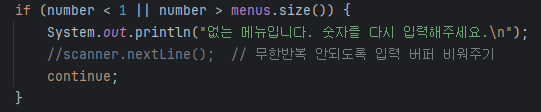
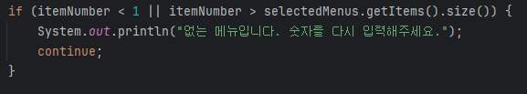
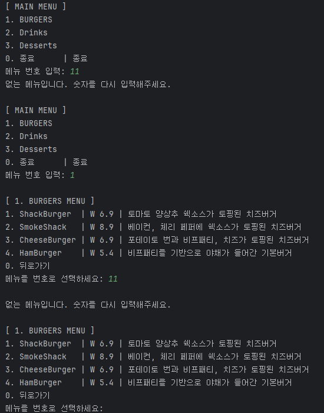

# 키오스크 과제

자바로 구현한 콘솔 기반 햄버거 키오스크 시스템입니다.  
lv1 ~ lv5로 진행되며, lv1 ~ lv4 까지 패키지로 구분하여 진행하였습니다.
(lv4에 lv5까지 포함되어 최종 키오스크가 완성되었습니다.)

---

## 목차
- [소개](#소개)
- [lv1 ~ lv5 요약](#lv1--lv5-요약)
- [클래스별 역할 및 기능](#클래스별-역할-및-기능)
- [실행 예시](#실행-예시)
- [예외 처리](#예외-처리)
---

## 소개

이 프로그램은 햄버거 키오스크를 자바 콘솔에서 구현한 예제입니다.  

클래스는 Main, Kiosk, Menu, MenuItem 이렇게 4개로 구성되어 있습니다.
메인 메뉴에서는 카테고리를 선택할 수 있으며, 메인 카테고리 선택 후 세부 메뉴 선택이 가능합니다.
세부 메뉴에서 다시 메인으로 돌아갈 수 있는 기능과 종료 기능까지 같이 구현되어 있습니다.

---

## lv1 ~ lv5 요약

  [lv1. 기본 흐름 구현]
- Scanner 사용하여 숫자 입력 받고 메뉴 출력
- 조건문 활용해 입력받은 숫자에 따른 처리
- 반복문 활용해 반복 입력 흐름 제어
- 0 입력 시 프로그램 종료


[lv2. MenuItem 클래스 도입 - 객체 지향 적용 시작]
- MenuItem 클래스 생성 -> 메뉴 항목 하나를 객체로 표현
- 필드: 이름(name), 가격(price), 설명(description)
- List&lt;MenuItem&gt;에 항목들을 저장/관리
- 반복문 활용해 전체 메뉴 항목 출력


[lv3. Kiosk 클래스 도입]
- start() 메서드로 전체 입력 흐름을 한 곳에서 관리
- 전체 키오스크 흐름 구현(main에서 관리하던 기능 이전)
- 오류 메세지 출력(숫자 외 입력시)


[lv4. Menu 클래스 도입 - 계층형 메뉴 구현]
- Menu 클래스 도입 -> 하나의 메뉴 카테고리 구성
- List<Menu> : 상위 카테고리
- 각 Menu는 내부에 List<MenuItem> 포함
- 상위 메뉴 선택 시, 해당 하위 항목 출력
- 뒤로가기(하위->상위) 기능 구현


[lv5. 캡슐화]
- 모든 클래스의 필드를 private 로 설정
- 외부에서는 직접 접근 불가 -> Getter / Setter 로 간접 접근
- ex)
```java
item.name -> item.getName()
```

---

## 클래스별 역할 및 기능

  [Main]
- 프로그램의 시작점
- Menu 객체 생성 및 MenuItem 항목 추가
- Kiosk 객체 생성 및 start() 실행

[MeneItem]
- 세부 항목 관리 (하위 메뉴 항목)
- 주요 필드 : name, price, description
- 생성자 및 getter/setter 제공
- getter 메서드 통해 항목 정보 출력

[Menu]
- 카테고리 항목 관리 (상위 메뉴 항목)
- 필드: categoryName, items
- List<MenuItem>에 항목들을 저장/관리
- addMenuItem() -> 하위 메뉴 항목 추가 기능
- printItems() -> 메뉴 항목 출력 기능
- getItems() -> 메뉴 항목 리스트 반환 기능

[Kiosk]
- 전체 메뉴 흐름 제어
- 사용자 입/출력, 메뉴 선택 처리 담당
- 주요 필드 : menus
- start()
   - 메인 메뉴 출력 -> 카테고리 선택
   - 선택된 메뉴 항목 출력
   - 예외처리(숫자 외 입력시)
   - '0' 입력처리 (종료/뒤로가기)

---

## 실행 예시

1. 상위 카테고리 선택 -> 하위 메뉴 선택 -> 선택 메뉴 표시 (하위 메뉴 재선택 가능)

2. 상위 카테고리 선택 -> 하위 메뉴 선택 -> 상위 카테고리로 돌아가기

3. 상위 카테고리에서 종료
4. 


---

## 예외 처리

예외처리 : try-catch / while / if 문 활용

1. 문자 입력 시 메세지 알림 후 재입력 가능(catch-InputMismatchException e)
  - 상위/하위 나눠 구현 한 이유는 재입력 위치가 다르기 때문
[코드 및 구현 사진 첨부]


2. 메뉴번호 이외 숫자 입력 시 메세지 알림 후 재입력 가능(try -> if)
[코드 및 구현 사진 첨부]


